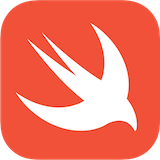

Swift v5.7 | [different versions](find-my-swift-version.md) | [Swift.org](https://docs.swift.org) 

Sources taken from the [official Swift documentation](https://docs.swift.org/swift-book/LanguageGuide/TheBasics.html).

# 👨🏿‍💻🧑🏻‍💻👩🏾‍💻 HOW TO LEARN SWIFT
Swift has a lot of features, but the basics can be learned fast! Write as much code as you can learning the foundational concepts first and practicing mixing them together at every opportunity.

To try and help you learn faster:

* Our courses are created from the official Swift documentation simplifying it for fast learning. [Try it](https://www.udemy.com/user/iosbfree).
* Our courses are interactive from the start. [Try it](https://www.udemy.com/user/iosbfree).
* Lessons are provided within an editable and interactable Swift playground. [Try it](https://www.udemy.com/user/iosbfree).
* Lessons are run within Xcode - the tool proffessionals use to write apps!
* Our GitHub contains Swift playgrounds converting the official Swift documentation into executable examples. [Try it](https://github.com/MatthewpHarding/SWIFTDOCS-1-the-basics/archive/refs/heads/main.zip). 👈
* Our GitHub contains the official Swift documentation converted into markdown files, making it searchable - [Try it](https://github.com/MatthewpHarding?tab=repositories&q=SWIFTDOCS+hello+world).

# 🧑🏼‍💻 About The Instructor 
>👋👋🏻👋🏿 Hi everyone,
>
>I've been developing iOS apps since the first ever release (2008) and have an enormous amount of experience. I hope I can share this information passing tips & tricks on to the next generation. I've had my career - **it's time for yours!**

🧕🏻👨🏿‍💼👩🏼‍💼👩🏻‍💻👨🏼‍💼🧛🏻‍♀️👩🏼‍💻💁🏽‍♂️🕵🏻‍♂️🧝🏼‍♀️🦹🏼‍♀🧕🏾🧟‍♂️

## Matts Career Achievements 
* Invited to Apple HQ to work on a secret project
* Developer behind the 10 billionth download app on AppStore
* Substantially increased profits for London based financial companies
* Created the worlds 1st iPhone, iPad and  Watch apps
* Several apps have been advertised on TV, radio, magazines, newspapers books and Apple's website
* One of the **1st iOS developers in the world**

## Some Quick Tips 💡
1. Study the Swift programming language
2. Learn the language first
3. Learn how to build apps second
4. Learn by writing your own tutorials inside Xcode .playground files
5. Set monthly goals to learn `x` by date `y`
6. Aim to write a complete tutorial (.md files & .playground files) by your set goal
7. Place the tutorial up on your GitHub account (create one) for others to learn too 👍

## Our Services
We made the official Swift documentation searchable. [Try it](https://github.com/MatthewpHarding?tab=repositories&q=SWIFTDOCS+hello+world). Our aim is to optimise career growth for juniors learning iOS by teaching Swift via our online courses. We have taken the official Swift documentation and **simplified it** for fast learning. 😎

💡 **Top Tip**: During an iOS interview they'll ask questions about Swift, not iOS! To BOOST 🚀 your career forwards become an expert of the Swift language.

- 🔍 **Searchable Swift documentation**: [Try it](https://github.com/MatthewpHarding?tab=repositories&q=SWIFTDOCS+hello+world).

- 🕊 **Xcode playgrounds**: Run and execute the [official Swift documentation](https://github.com/MatthewpHarding/SWIFTDOCS-1-the-basics) in Xcode! . [Try it](https://github.com/MatthewpHarding/SWIFTDOCS-1-the-basics/archive/refs/heads/main.zip).

- 👉 **Online Courses**: [**Swift Simplified** *(for fast learning)* A Guided Tour of Swift](https://www.udemy.com/user/iosbfree) can be found on [Udemy.com](https://www.udemy.com/user/iosbfree). [Try it](https://www.udemy.com/user/iosbfree).

- *Preview* our Online Course Xcode playground [**Swift Simplified**: A Guided Tour of Swift](https://github.com/MatthewpHarding/a-tour-of-swift) 

# 🧑🏼‍💻
Created by Matthew Harding
@[MatthewpHarding](https://github.com/MatthewpHarding) 🔗

🤩 *..let's live a better life, by learning Swift* 🛠

```Swift
let myLife = [learning, coding, happiness] 
```
### 🧕🏻👨🏿‍💼👩🏼‍💼👩🏻‍💻👨🏼‍💼🧛🏻‍♀️👩🏼‍💻💁🏽‍♂️🕵🏻‍♂️🧝🏼‍♀️🦹🏼‍♀🧕🏾🧟‍♂️
